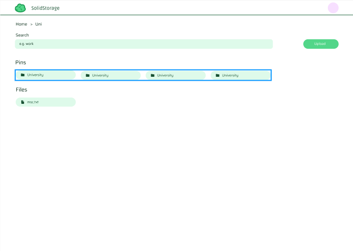
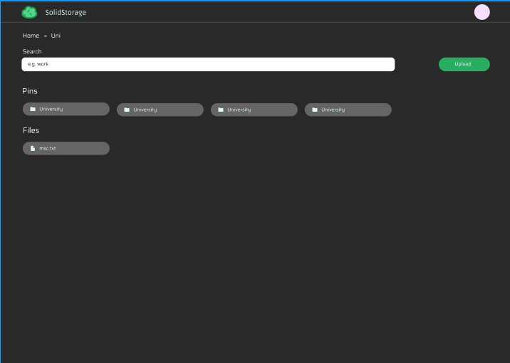

# Description

A simple cloud storage app.



This project uses:

- Next.js for the frontend
- Express.js for the backend
- Auth0
- [Caddy](https://caddyserver.com/) to serve https locally by creating reverse-proxies for the frontend and the backend; integration with Auth0 in Next.js doesn't work properly without HTTPS, so that's why Caddy is used.
- An S3 bucket to store files.
- and, PostgreSQL to store files' metadata.

# Install

```
git clone https://github.com/RaksaRS/solidstore
```

## Configuration

- Auth0:

  - Create a machine-to-machine client. Add `https://localhost:5213, https://localhost:5213/api/auth/callback, http://localhost:3000/api/auth/callback, http://localhost:3000/` to allowed callback URLs,

    and `https://localhost:5213, https://{YOUR_AUTH0_BASE_ISSUER_URL}/v2/logout` to allowed logout URLs.

    Then, follow this [link](https://auth0.com/docs/get-started/authentication-and-authorization-flow/resource-owner-password-flow/call-your-api-using-resource-owner-password-flow) to setup a authentication flow.

  - Create an API. Configure your scopes/permissions for create, read, delete files. Next, authorize the client to request access tokens.

- S3: Add the following CORS policy:

  ```
  [
      {
          "AllowedHeaders": [
              "*"
          ],
          "AllowedMethods": [
              "PUT",
              "POST",
              "DELETE",
              "GET"
          ],
          "AllowedOrigins": [
              "*"
          ],
          "ExposeHeaders": [],
          "MaxAgeSeconds": 3000
      }
  ]
  ```

- Caddy: Manually install caddy.

- PostgreSQL: Run the migration script
  ```
  cd server
  pnpm typeorm migration:run -d ./db-data-source.ts
  ```

Next, configure the environment variables.

Then, with **_admin/root privilege_**, install a local PKI

```
cd solidstore
caddy start
```

The above installs a local PKI and adds the root CA to your local trust store. If the root CA is not in your local trust store, you can run `caddy trust` with **_admin/root privilege_** to explictly add it to your local trust store.

Finally, build and serve!

```
# Build and frontend
cd client
pnpm build
pnpm start

# Run backend:
cd ../server
pnpm dev
```

To run tests for the frontend, run

```
# Since tests are written to work w/ HTTPS, make sure to start caddy if it's not yet started
caddy start

# Run the tests
pnpm test
```

To run tests for the backend, you don't need to run caddy

```
pnpm test
```
